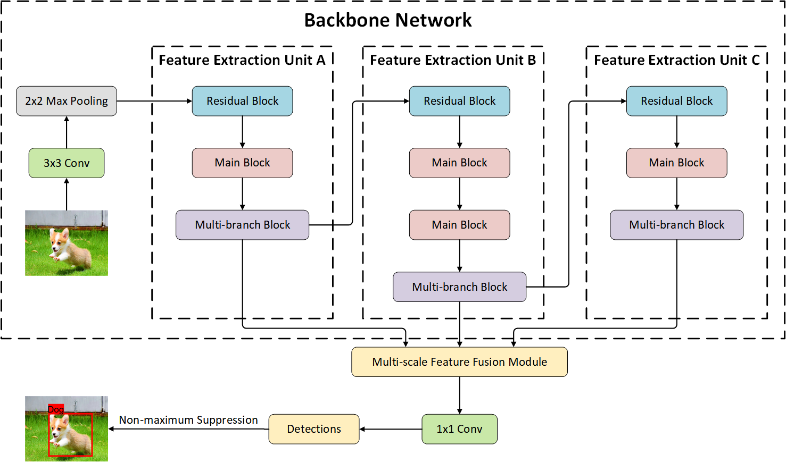
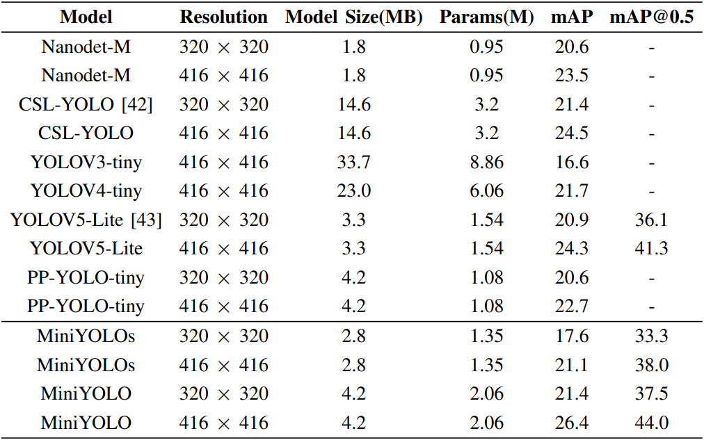

# MiniYOLO: A Lightweight Object Detection Algorithm that Realizes the Trade-off between Model Size and Detection Accuracy

The framework of MiniYOLO is as follows:

MiniYOLO is a lightweight one-stage object detection algorithm, 
mainly including two parts: backbone network and multi-scale feature fusion module. 
To reduce the model size and the number of parameters, the backbone network adopts the depthwise separable convolution and various efficient network structures. 
To utilize the features of different scales more effectively and improve the detection accuracy, this paper
Two multi-scale feature fusion structures based on PAN are used. 
To adapt MiniYOLO to different datasets, a 1 × 1 standard convolution is added after the multi-scale feature fusion module.

Comparison of MiniYOLO and other Lightweight Models in COCO mAP and Model Size is as follows:

